## UV: Python Package And Project Manager

uv is a fast, powerful all in one package manager for Python coded to replace tools like pip and virtual env, that is written in Rust and is 10-100 times faster than pip.
- manages venv
- package management
- dependency resolution
- python versions

---

#### Performance and Architectural Differences
Python vs Rust:
- traditional tools like pip are written in python, meaning each time a new venv is created, they have to spin up a python interpreter and execute sequentially
- in comparison, uv is written in rust, and complies down to native machine level code, which allows for concurrent downloads, and disk caching 

Global Caching & Hard Linking:
- uv uses global cache, and system hard links
    - this means instead of fully copying files over for each new virtual environment
    - it instantly links them, saving disk space, and reducing installation times to milliseconds

All in One Toolchain:
- traditional python workflows require stitching multiple utilities together
    - pyenv for python versions
    - virtual env for environments
    - pip for packages
    - poetry for locking
- rust in comparison combines version management, environment creation, and lock-files into a single unified binary

Error Diagnostics:
- rust based resolvers parse the dependency graphs instantly and provide clear readable error diagnostics when package conflicts occur
- avoiding the very lengthy error messages when there is a package conflict in pip (for example) where it takes minutes to find what when wrong

---

#### Setting Up Project and Environment
Creating a Project using uv:
- if the project dir already exists, then simply run `uv init` in the project dir
```python
uv init project-name
```
Which will then set up the following project:
```
project-name/
├── .python-version
├── README.md
├── main.py
└── pyproject.toml # where the project config lives, similar to requirements.txt: includes all project meta data and dependencies
```

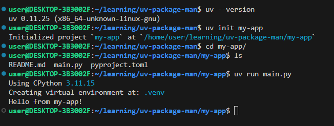
- running the main.py file also creates the venv in my-app

Adding Dependencies:
```
uv add pandas
```
- adds the pandas dependency to the project configuration (pyproject.toml) and installs it to the venv
- uv creates and manages the venv behind the scenes while in the project dir

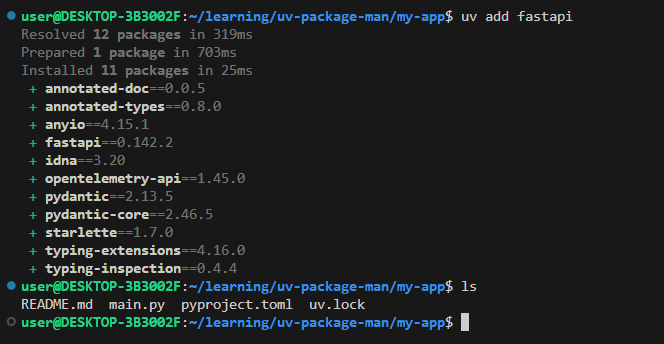
- uv.lock contains the exact versions of everything that is being used in the project
- pyproject.toml now has fastapi added to the dependencies
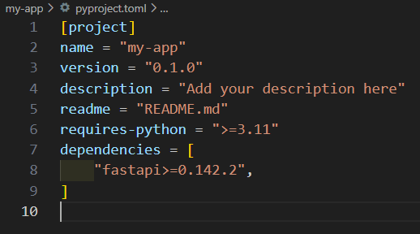

Running The Python Files:
```python
uv run main.py
```
- instead of using python to run files, uv is used
    - similar to `python file_name`, only `uv run` is switched out for python 

The uv workflow is significantly simpler and faster then using venv and pip
```bash
# workflow using venv and pip
python -m venv .venv
source venv/bin/activate
pip install fastapi pandas
```
- not only is uv faster, but it also automatically updates the pyproject.toml file with each added dependency, simplifying the workflow
- by comparison, when using venv and pip, the requirements.txt file would also have to be manually updated with each added dependency
    - the venv has to be created manually
    - it also has to be activated each time work is done on the project

---

#### Package Management
- uv uses version locking using the dependency uv.lock file
    - the uv.lock file stores the exact versions of all dependencies used, meaning whenever you build the project, you get the exact same results
    - without package locking some packages release new versions that break compatibility with other packages or the codebase 
    - eliminates the works on my machine issues, across different developers and operating systems(assuming that py-wheels are published for all OS's)


Checking Installed Packages:
```
uv tree
```
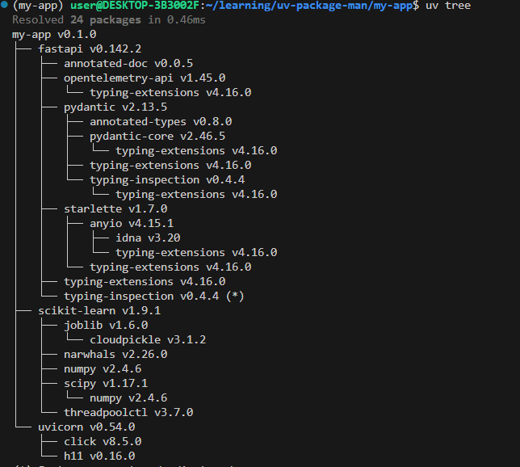
- shows the dependency tree of the entire project with the versions that each one has been installed with

Development Dependencies:
- packages that are separated from the normal dependencies
- packages that are required to write, test, format, and build the project, but are not required when the application is ran in production
    - developer tooling like: pytest, ruff
- when a library is published or an application is deployed, the dev dependencies are excluded so the production image is lean, and fast to build

```
uv add --dev pytest
```
- pytest is added for development purposes and not for the production build
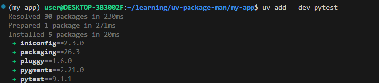
- under pyproject.toml, it can be seen that pytest has been added under a new dev dependency group
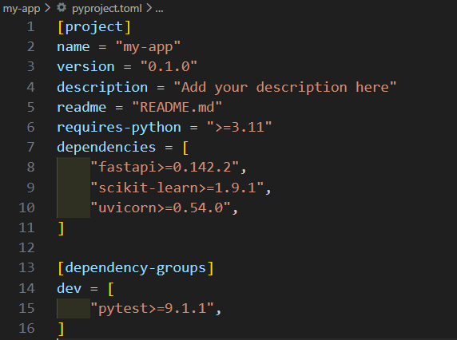

uv Sync
```
uv sync
```
- When you or someone else clones a fresh project run the `uv sync` command to set up the project
- ensuring that both users have the exact same environment so theres consistent builds with projects
- sync can also be used whenever the dependencies of the project are updated
    - adding or removing a package

Removing a package from the `pyproject.toml` file:
Ex: removing scikit-learn
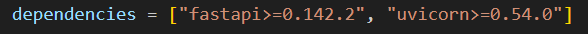
- then running `uv sync` removes scikit-learn and all the dependencies that it relies on
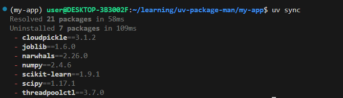
- scikit learn is uninstalled since uv realizes that the env is different from the `pyproject.toml`
- uv only removes packages that have been orphaned meaning that there are 0 packages left relying on them
    - meaning that if multiple packages rely on one dependency
    - then one of the packages is uninstalled, uv keeps the shared dependency installed

Removing Packages From The Terminal:
```
uv remove package_name
```
- instead of manually removing packages from the `pyproject.toml` file, then running `uv sync`, `uv remove` can be used
- the command removes the package everywhere
    - dependencies
    - lock file
    - environment
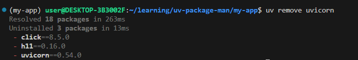
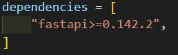
- uvicorn is no longer included in `pyproject.toml` dependencies

---

#### Running Tools with uvx
- uvx is used for running python tools without the need to install them globally

Example: using `black` to format code, without having to add it to the uv dependencies
- without uv the tool would have to be installed globally (with the potential for version conflicts)
- or use another tool like pipx

```
uvx black main.py
```
- tools can be ran using uvx by calling uvx in the terminal followed by:
    - the name of the tool: `black`
    - any of the tools arguments: `main.py` (which python file to fix the formatting for)
- behind the scenes, uv will automatically creates a temporary isolated environment, install the tool, then execute it
    - this process is cached, meaning that any subsequent uses, are faster

Example:
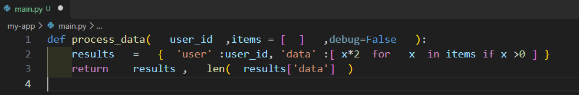
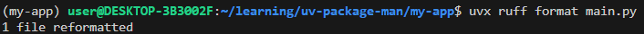
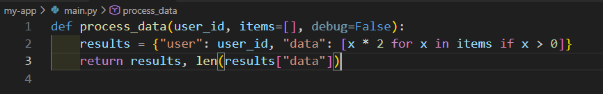
- ruff successfully formatted the project without adding anything to the dependencies 
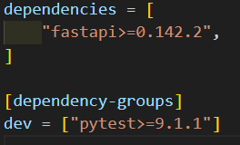
- meaning the tool was used without adding the dependency to `pyproject.toml`


*uvx*
- versions of tools can be specified when using uvx
- any tool that is available on PyPi can generally be called and used by uvx

Installing Tools Using uvx:
- Tools are installed globally across the entire OS, and does not require a Project/venv activated, working everywhere
```
uv tool install black
uv tool install httpie
```
- for tools that are used frequently, they can be installed using `uv tool install tool_name`
- they can be used, but are also isolated from the system Python and from projects
- they can then be run by
    - calling it directly by name:
        - uv's bin directory has been added to the shell's PATH, then the tool's command can be ran directly from the terminal
        - `ruff check .`
    - `uv tool run <tool-name> [arguments]`
- To see a list of installed tools:
```
uv tool list
```
- to upgrade an installed tool:
```
uv tool upgrade <tool-name>
```
- removing an installed tool:
```
uv tool uninstall <tool-name>
```

#### Conclusion
While `uv` is significantly faster than other Python package and project managers, it was not the sole reason for me to learn about it.
- while I have had my problems and nightmares with extremely slow anaconda env's 
    - when adding and removing venv
    - adding dependencies
    - manually selecting the correct env for each new project
    - version compatibility issues between conflicting dependencies that sometimes took hours to fix
    - (issues that were solved by switching to linux via WSL-Ubuntu and using pip & venv) 
- Some of the major reasons was the ease of use, reliability, QOL, universal true reproducibility(uv.lock), built in python version manager, seamless workflow (uv run/sync) all in a single application
- not having to juggle multiple tools when developing in python